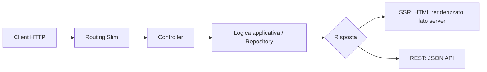
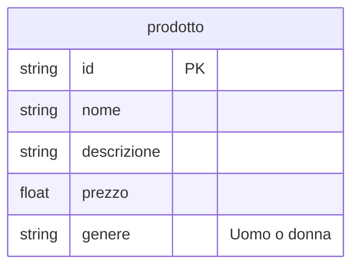
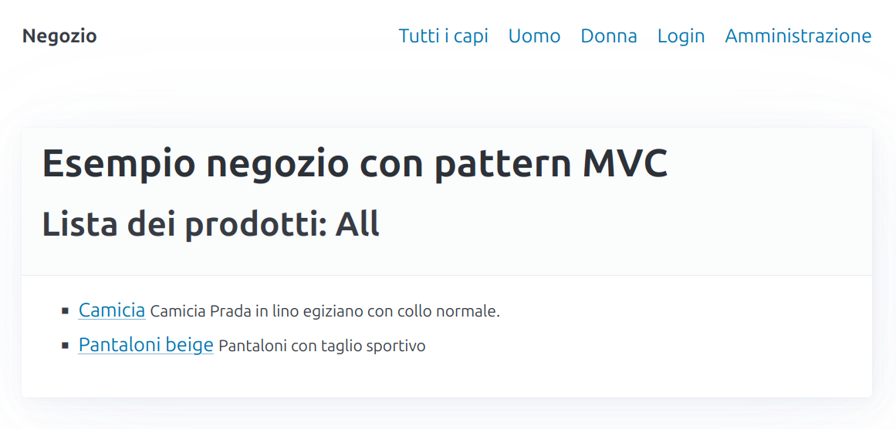
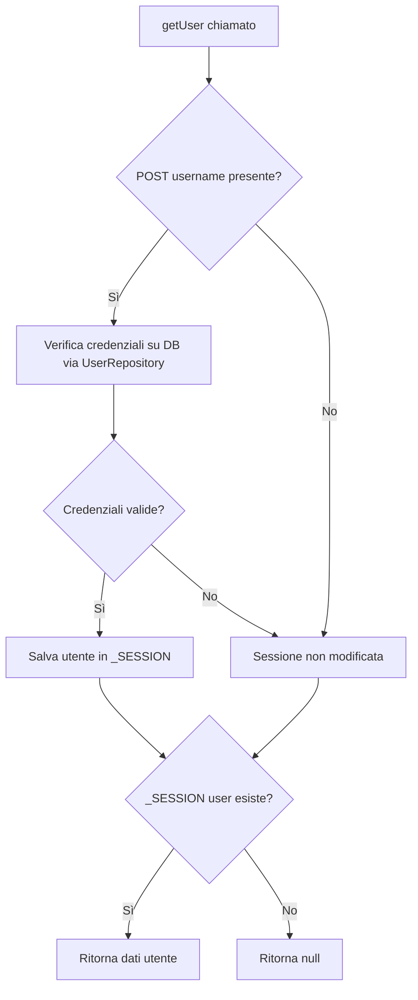
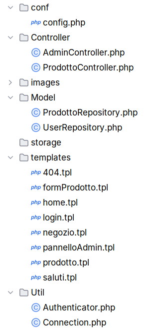

# Struttura di applicazioni complesse

Nelle applicazioni viste finora, la gestione di *cosa fare* in base al differente tipo di richiesta (GET, POST)
e dei parametri ricevuti, veniva gestita da un unico file, contenente una serie di `if`, ma, anche con poche 
e semplici funzionalità, tendeva a intricarsi velocemente. 

Per gestire meglio l'organizzazione di applicazioni di media complessità, senza aver la pretesa di utilizzare
librerie complete ma anche decisamente più complesse, si vedrà come utilizzare Slim e se ne fornirà
una proposta di come strutturare applicazioni con accesso a database e con presenza di più funzionalità.

## Il progetto in Docker (panoramica)

In origine questo progetto girava direttamente sulla macchina host. Ora invece viene eseguito in container,
in modo da avere un ambiente più ripetibile: stessa versione di servizi, stessa configurazione di rete
e meno differenze tra un computer e l'altro.

### Come è organizzato

Con `docker-compose.yml` vengono avviati due servizi principali:

- `web`: esegue PHP/Apache e serve l'applicazione
- `database`: esegue MariaDB con i dati dell'app

In sviluppo, `docker-compose.override.yml` aggiunge anche `adminer` per ispezionare il database via browser.

### Volumi e rete

La cartella `www/` del progetto è montata nel container `web` (`/var/www/html`), quindi quando modifichi il codice
locale, il container vede subito i cambiamenti. I dati del database e lo storage applicativo sono mantenuti in volumi
dedicati (`db_data` e `storage_data`), così non si perdono al riavvio dei container.

I servizi comunicano su una rete Docker privata (`app_network`): l'app può raggiungere il database usando il nome
del servizio (`database`) invece di un IP fisso.

### Da `.env` a `config.php`

Le variabili sono dichiarate in `.env.example` e valorizzate nel file locale `.env`.
Docker Compose passa quelle variabili ai container tramite `env_file`, e il codice PHP le legge tramite `$_ENV`.

Schema rapido del flusso:

```text
.env.example -> .env -> docker compose (env_file) -> container web -> $_ENV -> conf/config.php (costanti) -> codice applicativo
```

Per questo in `conf/config.php` trovi costanti ricavate da variabili ambiente, ad esempio:

- configurazione DB (`MYSQL_HOST`, `MYSQL_DATABASE`, `MYSQL_USER`, `MYSQL_PASSWORD`)
- configurazione applicativa (`APP_ENV`, `APP_DEBUG`, `TEMPLATE_DIR`, `IMAGES_DIR`, ...)

Nelle prossime sezioni useremo queste variabili in modo esplicito, così sarà chiaro dove vengono definite
e in quali punti dell'applicazione entrano in gioco.

## Cos'é Slim
Il sito di Slim definisce la libreria in questo modo

> Slim is a PHP micro framework that helps you quickly write simple yet powerful web applications and APIs.
> At its core, Slim is a dispatcher that receives an HTTP request, invokes an appropriate callback routine
> and returns an HTTP response. That’s it.

Quindi il nocciolo di quello che fa è di ricevere le richieste HTTP, *agganciarle* all'azione appropriata
e ritornare la corretta risposta HTTP. 


## Come creare la prima applicazione in Slim

Per informazioni più dettagliate si veda il sito di riferimento: [Slim](https://www.slimframework.com/docs/v4/)

### Come installare

In questo progetto le dipendenze PHP non vengono installate sulla macchina host, ma nel container `web`
dove Composer è già disponibile.

Le librerie richieste sono dichiarate in `composer.json` (ad esempio `slim/slim`, `slim/psr7`, `league/plates`
e `php-di/slim-bridge`), quindi è sufficiente installarle tutte in una volta con:

```bash
docker exec <PROJECT_NAME>_web composer install
```

Sostituisci `<PROJECT_NAME>` con il valore di `PROJECT_NAME` presente nel file `.env`.

In questa versione del progetto il front-controller è `index.php` nella cartella `www`.

Il contenuto di questo file può essere popolato in questo modo

```php
<?php
use Psr\Http\Message\ResponseInterface as Response;
use Psr\Http\Message\ServerRequestInterface as Request;
use Slim\Factory\AppFactory;

require 'vendor/autoload.php';
require_once 'conf/config.php';

$app = AppFactory::create();

$app->get('/', function (Request $request, Response $response, $args) {
    $response->getBody()->write('Hello world!');
    return $response;
});

$app->get('/altra_pagina', function (Request $request, Response $response, $args) {
    $response->getBody()->write('Questa è un\'altra pagina');
    return $response;
});

$app->run();
```

Le parti più importanti di questo codice sono:
1. la variabile `$app` rappresenta l'applicazione ed è quella che verrà usata per creare tutte le associazioni rotta - azione
2. per ogni rotta che si intende gestire, che in questo esempio sono la rotta "vuota" `/` e la rotta `/altra_pagina`, deve essere chiamato un metodo che mappa la richiesta HTTP che si intende utilizzare (GET, POST, ...) e nel quale vanno passati come parametri la rotta e l'azione da associare, sotto forma di funzione anonima. In questo esempio viene utilizzato per entrambe il metodo `get` e quindi una GET sulla rotta vuota produrrà una pagina con la scritta `Hello world` e una GET sulla rotta `/altra_pagina` produrrà la scritta `Questa è un'altra pagina`.
3. I parametri della funzione anonima sono tre e rappresentano nell'ordine l'oggetto che contiene le informazioni della richiesta (`$request`), quello che conterrà le informazioni della risposta (`$response`) e un vettore (`$args`) che conterrà eventuali parametri contenuti nella rotta (si veda l'esempio con i template)
4. Nel corpo della funzione avviene la scrittura del body della risposta, utilizzando il metodo `write` applicato appunto al body e scrivendo quello che si vuole sia contenuto nella pagina di risposta (**attenzione**: il body della risposta è quello relativo al protocollo HTTP, non ha nulla a che vedere con il body della pagina HTML, hanno solo lo stesso nome).


L'applicazione espone le rotte direttamente dalla root del sito e nei template i link vengono scritti in modo root-relative, ad esempio `/negozio`, `/admin` o `/login`.

## Configurare Apache per l'URL rewriting

In un'applicazione web è una buona idea avere un solo *front-controller*, cioè un unico file, nel nostro caso `index.php`, a cui arrivano tutte le richieste HTTP, indipendentemente dalla *rotta* effettiva della richiesta: quindi richieste indirizzate ad esempio a `/negozio/accessori` piuttosto che ad
`/admin/` passeranno comunque attraverso il file `index.php`, che
si occuperà del *dispatching*, della *distribuzione*, al pezzo di 
codice che dovrà gestire ogni particolare richiesta.

Se quindi l'applicazione ha bisogno che tutte le richieste HTTP arrivino al file *index.php*, è necessario istruire il web server per fare in modo che ogni richiesta che arriva, indipendentemente dall'URL effettivo, venga dirottata sul file `index.php`.

Nel progetto attuale questa parte è già predisposta nella configurazione del container `web`.

La riscrittura delle URL è gestita dal file `.htaccess` presente in `www/`, con questo contenuto:

```apacheconf
RewriteEngine On

#Queste prime due righe servono per servire gli assets, in pratica
#istruiscono Apache a restituire un file se esiste, piuttosto che girare
#la richiesta a index.php
RewriteCond %{REQUEST_FILENAME} !-d
RewriteCond %{REQUEST_FILENAME} !-f
RewriteRule ^ index.php [QSA,L]
```

Le due condizioni hanno un ruolo importante:

- `RewriteCond %{REQUEST_FILENAME} !-d`: se la richiesta punta a una directory esistente, Apache non la riscrive.
- `RewriteCond %{REQUEST_FILENAME} !-f`: se la richiesta punta a un file esistente (per esempio immagini, CSS o JS), Apache non la riscrive.

In tutti gli altri casi la richiesta viene inoltrata a `index.php`, che funge da front-controller dell'applicazione.

## Gestione degli errori
Slim prevede già un meccanismo di gestione degli errori/eccezioni con un proprio Middleware[^middleware].
Nel progetto attuale viene configurato così:

```php
$errorMiddleware = $app->addErrorMiddleware(APP_DEBUG, true, true);
if (APP_USE_CUSTOM_ERROR_HANDLER) {
    $errorMiddleware->setDefaultErrorHandler($customErrorHandler);
}
```

Il primo parametro (`APP_DEBUG`) decide se mostrare i dettagli degli errori in output:

- in sviluppo, di solito è `true`
- in produzione, di solito è `false`

I valori arrivano dalle variabili ambiente lette in `conf/config.php`.

Oltre al middleware standard, in `index.php` è definita anche una callback personalizzata (`$customErrorHandler`)
che gestisce due casi specifici:

- `HttpNotFoundException`: renderizza il template `404`
- `HttpUnauthorizedException`: restituisce il messaggio `Utente non loggato`

In questo modo puoi scegliere se usare il comportamento standard di Slim o quello personalizzato,
semplicemente cambiando `APP_USE_CUSTOM_ERROR_HANDLER` nel file `.env`.

[^middleware]: Per *middleware* in questi contesti si intende uno strato di software che si interpone tra la richiesta dell'utente e l'applicazione 
vera e proprio, per svolgere delle funzionalità che sono comuni a 
moltissime applicazioni e che, quindi, possono essere riutilizzate
senza bisogno di particolari modifiche. Esempi di middleware sono appunto la gestione delle eccezioni e l'autenticazione.

Per maggiori dettagli sul middleware errori di Slim: [documentazione ufficiale](https://www.slimframework.com/docs/v4/middleware/error-handling.html).

### Da qui in poi: focus SSR

La struttura vista fin qui (bootstrap dell'app, routing, middleware, controller e accesso ai dati) può essere
usata sia per applicazioni SSR sia per REST API. La parte comune è la pipeline della richiesta; cambia soprattutto
come viene costruita la risposta finale.

Da questo punto in avanti il percorso didattico prosegue con **SSR**: i controller renderizzano template HTML
sul server e inviano al browser una pagina già pronta.



## Utilizzare Plates
Nel progetto attuale la generazione delle pagine HTML lato server viene fatta con Plates,
integrato in Slim tramite container DI.

Nel bootstrap (`index.php`) viene creato il container, associato all'applicazione e usato
per registrare un servizio chiamato `template`:

```php
$container = new Container();
//da inserire prima della create di AppFactory
AppFactory::setContainer($container);

$container->set('template', function (){
    $engine = new Engine(TEMPLATE_DIR, 'tpl');
    $user = Authenticator::getUser();
    $username = isset($user['username']) ? $user['username'] : null;
    $engine->addData([
        'user' => $username,
        'images_base_url' => IMAGES_BASE_URL,
        'assets_base_url' => ASSETS_BASE_URL,
        'upload_max_file_size' => UPLOAD_MAX_FILE_SIZE,
    ]);
    return $engine;
});
```

In questo modo:

- `TEMPLATE_DIR` (da `conf/config.php` e variabili ambiente) indica la cartella dei template
- i dati condivisi via `addData(...)` sono disponibili in tutti i file `.tpl`
- i template possono usare URL root-relative e variabili comuni senza duplicare codice

Per usare Plates dentro una route, si recupera il servizio dal container e si chiama `render(...)`:

```php
$app->get('/saluti/{name}', function (Request $request, Response $response, $args) {
    $template = $this->get('template');
    $response->getBody()->write($template->render('saluti',
            [
                'name' => $args['name']
            ]
        )
    );
    return $response;
});
```

Nel caso dell'esempio, il parametro di rotta `{name}` viene letto da `$args['name']` e passato al template
`saluti.tpl`.


## Connessione al database

Nel progetto attuale i parametri di connessione arrivano dalle variabili ambiente e vengono
centralizzati in `conf/config.php`.

```php
define('DB_HOST', $_ENV['MYSQL_HOST'] ?? 'database');
define('DB_NAME', $_ENV['MYSQL_DATABASE'] ?? '');
define('DB_USER', $_ENV['MYSQL_USER'] ?? '');
define('DB_PASSWORD', $_ENV['MYSQL_PASSWORD'] ?? '');
define('DB_CHAR', 'utf8mb4');
```

In questo modo la configurazione è unica e può cambiare tra ambienti (sviluppo, test, produzione)
senza modificare il codice PHP.

La connessione vera e propria è incapsulata in `Util/Connection.php`, che espone un metodo statico
`getInstance()` per ottenere un oggetto `PDO` riutilizzabile dai repository.

L'idea è:

- i repository non conoscono i dettagli del DSN
- la connessione viene creata in un solo punto
- il resto del codice usa sempre `Connection::getInstance()`

Esempio d'uso dentro un repository:

```php
public static function listAll(){
    $pdo = Connection::getInstance();
    $risposta = $pdo->query("SELECT * FROM prodotto");
    return $risposta->fetchAll();
}
```

## Gestione dei dati presenti nel DB con il pattern MVC

In questa applicazione la **View** è composta dai template Plates (`.tpl`), il **Model** è rappresentato
dai repository, e i **Controller** orchestrano la logica tra richiesta HTTP, model e risposta.

### Esempio della gestione di un negozio

Per applicare i concetti a un esempio verrà ripreso il negozio di prodotti d'abbigliamento,
dove per semplicità verrà considerata solo la presenza della tabella **prodotto** mostrata qua sotto:



## Repository: `ProdottoRepository`

`Model/ProdottoRepository.php` incapsula le query SQL sulla tabella `prodotto`.
Nel progetto attuale espone metodi per:

- lettura (`listAll`, `listAllMale`, `listAllFemale`, `getProdotto`)
- scrittura (`add`, `update`, `delete`)

```php
class ProdottoRepository{

    public static function listAll(){
        $pdo = Connection::getInstance();
        $risposta = $pdo->query("SELECT * FROM prodotto");
        return $risposta->fetchAll();
    }

    public static function listAllMale(){
        $pdo = Connection::getInstance();
        $risposta = $pdo->query('SELECT * FROM prodotto WHERE genere = "Uomo"');
        return $risposta->fetchAll();
    }

    public static function listAllFemale(){
        $pdo = Connection::getInstance();
        $risposta = $pdo->query('SELECT * FROM prodotto WHERE genere = "Donna"');
        return $risposta->fetchAll();
    }

    public static function getProdotto(int $id){
        $pdo = Connection::getInstance();
        $risposta = $pdo->prepare('SELECT * FROM prodotto WHERE id = :id');
        $risposta->execute(['id' => $id]);
        return $risposta->fetch();
    }
}
```

Il controller usa questi metodi senza doversi occupare direttamente di SQL.

## Controller: `ProdottoController` e `AdminController`

I controller in `Controller/` ricevono richiesta/risposta, chiamano i repository e producono
la risposta finale (SSR HTML o redirect).

```php
class ProdottoController{

    private $container;

    public function __construct(ContainerInterface $container)
    {
        $this->container = $container;
    }

    public function listAll(Request $request, Response $response, array $args): Response
    {
        return $this->listAllByGenre($request, $response, ['genere' => 'All']);
    }

    public function listAllByGenre(Request $request, Response $response, array $args): Response
    {
        $genere = $args['genere'];
        if ($genere === 'Uomo')
            $prodotti = ProdottoRepository::listAllMale();
        else if ($genere === 'Donna')
            $prodotti = ProdottoRepository::listAllFemale();
        else
            $prodotti = ProdottoRepository::listAll();
        $engine = $this->container->get('template');
        $response->getBody()->write($engine->render('negozio',
            [
                'prodotti' => $prodotti,
                'genere' => $genere
            ]
        ));
        return $response;
    }
}
```

`AdminController` gestisce invece autenticazione, form di inserimento/modifica, upload immagini e operazioni CRUD amministrative.

### Aggancio tra rotta e metodo del controller

In `index.php` l'aggancio avviene con la sintassi:

`ControllerClass::class . ':nomeMetodo'`

Esempi reali del progetto:

```php
$app->get('/negozio', ProdottoController::class . ':listAll');
$app->get('/negozio/genere/{genere}', ProdottoController::class . ':listAllByGenre');

$app->get('/admin/prodotto[/{id}]', AdminController::class . ':formProdotto');
$app->post('/admin/prodotto[/{id}]', AdminController::class . ':addProdotto');
```

Come funziona in pratica:

1. Slim intercetta la rotta (`/negozio`, `/admin/prodotto/...`, ...).
2. Istanzia il controller passando il container nel costruttore.
3. Invoca il metodo indicato dopo `:`.
4. Passa al metodo `Request`, `Response` e gli eventuali parametri di rotta (`$args`).

Le parti tra `{}` sono parametri obbligatori (es. `{genere}`), mentre `[/{id}]` indica una parte opzionale.

### Esempio di resa SSR con template

Il metodo `listAllByGenre` renderizza `negozio.tpl`. Un estratto reale del template è:

```html
<?php $this->layout('home', ['title' => 'Negozio']) ?>

<article>
    <header>
        <h1>Esempio negozio con pattern MVC</h1>
        <h2>Lista dei prodotti: <?=$genere?></h2>
    </header>

    <ul>
        <?php foreach ($prodotti as $prodotto): ?>
            <li>
                <a href="/negozio/prodotto/<?=$prodotto['id']?>"><?=$prodotto['nome']?></a>
                <small><?=$prodotto['descrizione']?></small>
            </li>
        <?php endforeach;?>
    </ul>
</article>
```

Con la rotta `GET /negozio/genere/Donna` la resa può essere, ad esempio, la seguente:



## Autenticazione

L'autenticazione in questa applicazione ha uno scopo preciso e limitato: garantire che solo
l'amministratore possa accedere al backend di gestione dei prodotti (rotte `/admin/...`).
Gli utenti del negozio non vengono gestiti: la parte pubblica (`/negozio/...`) è liberamente
accessibile senza alcun login.

### Come funziona il middleware di autenticazione

In `index.php` è registrato un middleware che intercetta ogni richiesta prima che arrivi al controller.
La logica è semplice:

- le rotte che iniziano con `/negozio` passano sempre senza controlli
- la rotta `/login` passa sempre (altrimenti l'amministratore non potrebbe autenticarsi)
- tutte le altre rotte richiedono una sessione attiva; se non c'è, viene lanciata una `HttpUnauthorizedException`

### La classe `Util/Authenticator`

`Authenticator` è una classe di utilità con costruttore privato (non viene mai istanziata direttamente).
Espone due metodi statici:

- `getUser()`: restituisce i dati dell'utente loggato, oppure `null` se non c'è sessione attiva
- `logout()`: distrugge la sessione corrente

Il flusso di `getUser()` è il seguente:



In pratica, `getUser()` svolge due compiti in uno: se nella richiesta ci sono le credenziali POST
(cioè se il form di login è stato inviato), tenta il login e aggiorna la sessione; in ogni caso
restituisce l'utente corrente dalla sessione, o `null` se non c'è.

### Le sessioni PHP

PHP gestisce le sessioni tramite un cookie di sessione sul browser e un file (o altra struttura)
sul server. `session_start()` associa la richiesta corrente a una sessione esistente, oppure ne crea
una nuova. Le variabili in `$_SESSION` sono persistenti tra una richiesta e l'altra per lo stesso
utente, finché la sessione non scade o viene esplicitamente distrutta con `session_destroy()`.

In questo progetto la sessione viene avviata al primo accesso a `getUser()` (tramite il metodo
privato `start()`), ed è usata esclusivamente per memorizzare le informazioni dell'amministratore
autenticato (`$_SESSION['user']`).

### Dati dell'utente nei template

Quando il container `template` viene inizializzato in `index.php`, viene chiamato `getUser()` per
leggere l'eventuale utente in sessione e passare il suo username a tutti i template tramite
`addData(['user' => $username])`. Questo permette ai template di mostrare i controlli admin
(o nasconderli) in base allo stato del login, senza che ogni singolo controller debba occuparsene.

# Riassunto
Riassumendo quanto visto finora:

- il front-controller è `www/index.php`, che riceve le richieste e le instrada tramite il router di Slim
- Apache nel container usa `.htaccess` per inoltrare a `index.php` solo le richieste che non corrispondono a file o directory reali
- la configurazione applicativa e database è centralizzata in `www/conf/config.php` e alimentata da variabili ambiente (`.env`)
- la connessione al DB è incapsulata in `Util/Connection`, mentre le query stanno nei repository (`Model/`)
- i controller (`Controller/`) orchestrano richiesta, model e risposta SSR (render template) o redirect
- l'aggancio tra rotta e metodo usa la forma `ClasseController::class . ':metodo'`, con parametri in `{...}` e segmenti opzionali in `[...]`
- l'autenticazione è gestita da `Util/Authenticator` tramite sessioni PHP ed è usata solo per proteggere il backend admin; la parte pubblica del negozio non richiede login
- lo stato di autenticazione viene propagato a tutti i template tramite `addData(...)` nel momento in cui il container viene inizializzato

La struttura delle cartelle è la seguente:


